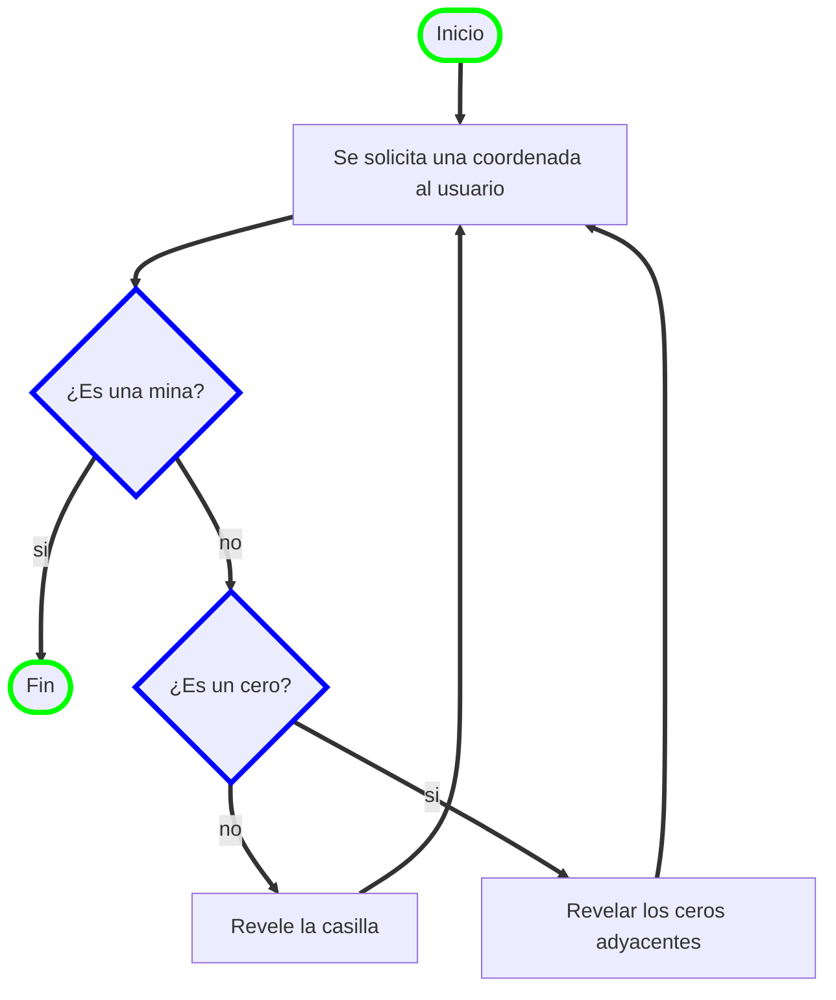

# Buscaminas: Proyecto Final

## Tabla de contenidos
  - [Introducción del proyecto](#introducción)
  - [Demostración del juego](#demostración-del-juego)
  - [Condiciones y alcance del problema](#condiciones-y-alcance-del-problema)
  - [Solución del problema](#solución-del-problema)
  - [Funciones del juego](funciones-del-juego)
  - [Función foco](#función-foco)
  - [Instalacion del programa](#instalación-del-programa)
  - [Próximos pasos (Mejoras)](#próximos-pasos-mejoras)

## Introducción
El **buscaminas** ha sido una fuente de entretenimiento que ha marcado varias generaciones. En este repositorio se dará a conocer el proceso y desarrollo de una versión funcional que sea fiel a las reglas basicas del buscaminas original. El funcionamiento del codigo esta sustentado en algoritmos que permiten funcionalidades como la creacion de un tablero, distribución de minas, o gestión de interacciones del jugador.

## Demostración del juego
- Demo del juego buscaminas en terminal usando python.
[](https://asciinema.org/a/706504)

## Condiciones y alcance del problema
El problema consiste en crear un código que emule un **buscaminas**, y que además cumpla con las siguientes condiciones:
  - Código original
  - Aborde temas aprendidos en clase
  - Tenga 3 niveles de dificultad
  - Se dibuje la matriz en la consola
  - Se interactue por medio de coordenadas
    
Adicionalmente se nos permitia que el proyecto llevara ciertos **extras**, como la cuenta regresiva y el conteo de puntos.
## Solución del problema
A grandes rasgos, el código se realizo de manera que se pueda jugar el clásico buscaminas por medio de la consola. En primer lugar, se usaron librerias como ```random```  que hizo posible generar numeros aleatorios para llenar el campo de juego. También fue indispensable el uso de ciclos ```for``` para la creación de funciones dedicadas diferentes aspectos del juego, como crear el tablero, crear minas y o revelar las fronteras; y una funcion principal para iniciar el juego.

- Funcionamiento general del código:
  ```mermaid
  flowchart TD


  id1([Inicio]) ==> B[Solicitar datos: Número de filas, columnas y dificultad]
  B==> C[Solicitar coordenada]
  C ==> D{¿Poner bandera?}
  D ==>|si|f[Colocar bandera] ==>C 
  D ==> |no|E[Revelar casilla]
  E ==> G{¿Es una mina?}
  G ==> |si|H([Fin])
  G ==> |no|I{¿Quedan casillas sin minar?}
  I ==> |no|H
  I ==> |si|C
  
  style id1 stroke:#0F0,stroke-width:4px
  style H stroke:#0F0,stroke-width:4px
  style D stroke:#00f,stroke-width:4px
  style G stroke:#00f,stroke-width:4px
  style I stroke:#00f,stroke-width:4px

  ```

## Funciones del juego
Cada función del código del juego cumple un propósito especifico. Estas son funciones son piezas fundamentales y permiten que el código funcione correctamente. El código del buscaminas se compone de diez funciones, dentro de las cuales se incluyen, funciones que "extra" que mejoran la experiencia de juego y una funcion principal.

- Funciones base:
  + Función ```crear_tablero```: Crea un tablero con las dimensiones que ingresa el jugador.
  + Función ```mostrar_tablero```: Muestra el tablero en la consola, sobre este tablero se empezara a jugar despues.
  + Función ```crear_minas```: Crea el tablero de minas según la dificultad especificada, 1 significa que hay mina, 0 es que la celda esta vacía.
  + Funciñon ```crear_fondo```: Calcula el fondo del tablero según la posición y número de minas adyacentes. Es decir, muestra el numero de minas que hay alrededor de una celda
  + Función ```jugar```: Verifica si el jugador pisa una mina o revela una celda vacía, evitando que se pierda en el primer turno. Determina si el tiempo de juego se agota o el jugador gana el juego.

- Funciones extra:
  + Función ```calcular_puntuacion```: Define la puntuación del juego basadandose las dimensiones del tablero y dificultad seleccionada.
  + Función ```limpiar_consola```: Limpia el contenido que se imprime en la consola, para una mejor visualización del juego
  + Función ```timer_thread```: Función que muestra la cuenta regresiva del tiempo restante.

- Función principal del juego.:
  + Función ```main```: Solicita al usuario las dimensiones, dificultad y duración, inicia la cuenta regresiva y arranca la partida.

## Función foco

Una de las funciones principales de este código es la función que se encarga de revelar las fronteras del tablero, es decir, al revelar una casilla con un cero (no tiene minas alrededor), automaticamente se van a seguir liberando las casillas que también contengan un cero.

- Diagrama del funcionamiento de la función:

Se decicidió implemntar la **recursividad** para esta funcion debido a que es un problema repetitivo, el uso de esta alternativa permite que el código fuera mas fácil de escribir y entender. Además, como se está trabajando con matrices pequeñas, la probabilidad de que la funcion genere error durante alguna de sus llamadas es baja, lo que no afecta la efectividad o rendimiento del código.


## Instalación del programa
Requires Python 3.x or later.

```sh
git clone https://github.com/samuelsabio06/Buscaminas_Proyecto_Final.git
cd Buscaminas_Proyecto_Final
python main.py
```

## Próximos pasos (Mejoras)
  - Agregar una interfaz
  - Agregar animaciones de bandera y bomba
  - Dejar de usar la consola para pedir coordenadas y cambiar a un sistema donde se use el mouse por medio de la interfaz
  - Revelar un area grande en el primer movimiento


