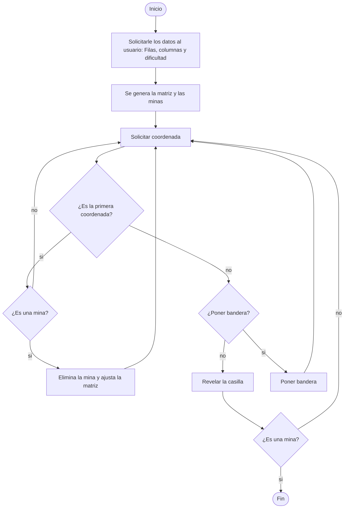

# Buscaminas_Proyecto_Final
---
Avance del proyecto

## 1. Diagrama preliminar: 
¿Como poner la condicion para ganar? Solo se aclaro la manera en que finaliza el juego si se encuentra una mina, es decir si se pierde.

